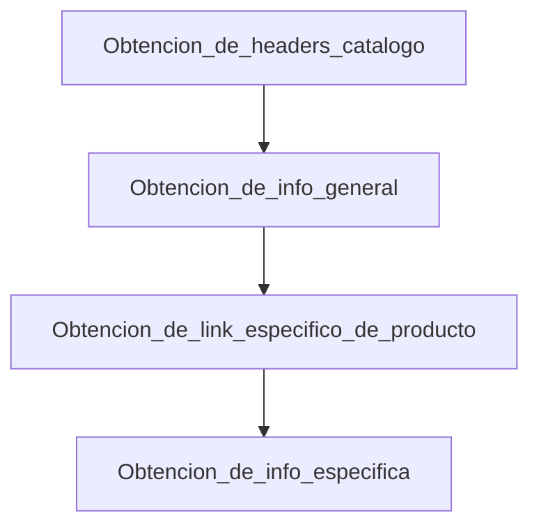

# Scraping web

web scraping para proyecto personal, en el cual se obtiene informacion de productos desde una web de un supermercado del territorio Nacional.

En el proceso, se separan dos etapas, en la cual se obtienen la informacion del producto desde la página catalogo (es decir, donde se depliegan cierta cantidad de productos del mismo tipo), y posteriormente se obtiene inforamción especifica de la pagina del producto. De manera general, se presenta el siguiente flujo de trabajo.

Para la obtencion de headers, es posible utilizar herramientas de inspector, burp o postman
